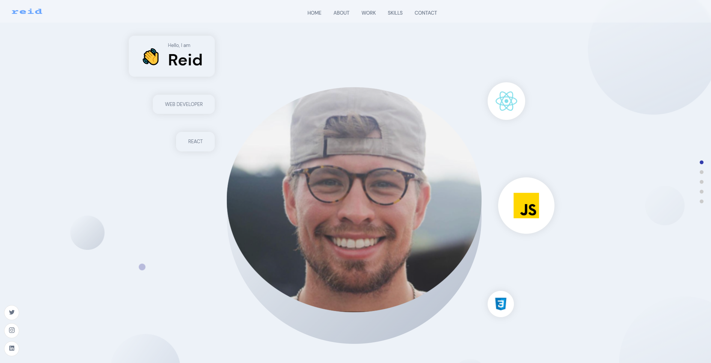

# portfolio-2.0

## Purpose

This is my second iteration of a portfolio. This site uses React and SCSS on the front end to create a dynamic page. 

The back end is held up by Sanity to create an easy form of editing the content on the back side.

## Table of Contents

-[Usage](#usage) -[Contribution](#contribution) -[Questions](#questions) -[Technologies](#technologies-used) -[Homepage](#homepage)

## Usage

- https://reidschroder.com

## Technologies Used:

- Javascript ES6
- Node.js
- React.JS
- SCSS
- Sanity
- CSS

## Homepage

## Contribution

- Made with ♡ by Reid

## Questions

- Like this project? Email with questions or contributions to @ reidschroder2@gmail.com